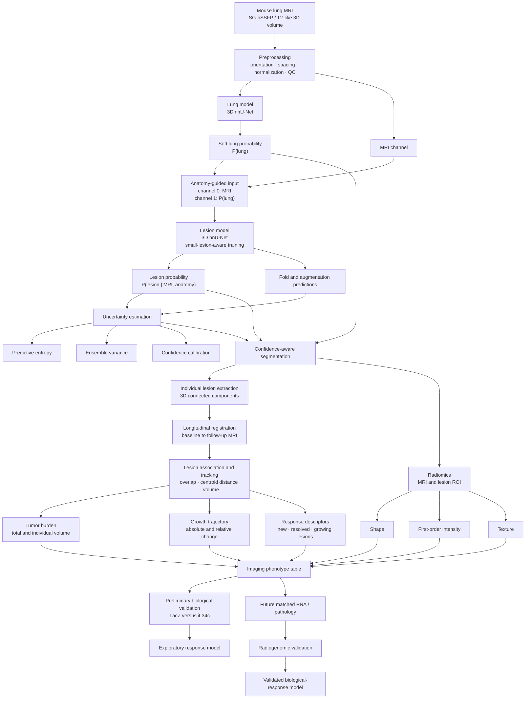

# Architecture and Experimental Pipeline

This document defines the end-to-end architecture for anatomy-guided mouse lung
lesion segmentation, uncertainty estimation, longitudinal quantification, and
future radiogenomic validation.

> **Research use only.** This preclinical research pipeline is not validated for
> clinical diagnosis or treatment.

## Implementation status

Status snapshot: **2026-08-29, lung folds 0–2 complete; fold 3 training started**.

Overall milestone count:

- **6 completed**
- **1 in progress**
- **6 pending**
- **1 waiting for external matched data**

| # | Milestone | Status | Current result or next action |
|---:|---|---|---|
| 1 | Download and verify official DeepMeta archive | Complete | Zenodo archive downloaded; MD5 and ZIP integrity verified. |
| 2 | Audit formats, labels, metadata, mice, and time points | Complete | Audit and case-level manifest generated. |
| 3 | Convert TIFF data to physical-space NIfTI | Complete | 103 lung cases and 92 valid lesion-training cases prepared. |
| 4 | Create mouse-grouped five-fold splits | Complete | Five folds generated with zero mouse overlap. |
| 5 | Plan and preprocess the lung dataset | Complete | nnU-Net 2D and 3D full-resolution preprocessing completed. |
| 6 | Train five lung folds and export validation probabilities | **In progress** | Fold 0: 0.9176/23 maps; Fold 1: 0.8414/22 maps; Fold 2: 0.9047/22 maps. Fold 3 is training; Fold 4 is pending. |
| 7 | Assemble out-of-fold lung probabilities | Pending | Requires completed validation probabilities from all five lung folds. |
| 8 | Build and preprocess the two-channel lesion dataset | Pending | Builder is implemented and intentionally waits for out-of-fold probabilities. |
| 9 | Train five anatomy-guided lesion folds | Pending | Starts after Dataset202 is built and preprocessed. |
| 10 | Generate ensemble uncertainty and calibrated confidence | Pending | Requires predictions from the five lesion folds. |
| 11 | Register and track longitudinal predicted lesions | Pending | Ground-truth volume utility exists; full tracking requires model predictions. |
| 12 | Extract and validate radiomic features | Pending | Requires final lesion ROIs and a fixed radiomics protocol. |
| 13 | Run preliminary LacZ/iL34c phenotype summary | Complete | Exploratory summary generated; sample size is insufficient for a biological claim. |
| 14 | Perform radiogenomic validation | **Waiting for data** | Requires matched per-mouse RNA and/or pathology measurements. |

The milestone count describes implementation progress, not scientific
validation. A stage is marked complete only when its required data products and
quality checks exist. Fold 0 was shortened from 1,000 to 500 epochs after its
validation Dice had reached a stable useful range, allowing an earlier formal
evaluation before committing resources to the remaining folds. Training resumed
from the backed-up epoch-400 checkpoint and completed normally. The 23-case
validation audit found a mean Dice of 0.9176, median Dice of 0.9770, and five
cases below 0.85; visual review showed boundary disagreement concentrated near
the diaphragm and outer lung margins. All 23 Fold 0 soft probability maps were
exported with `--npz`. The training log, audit outputs, and checkpoint directory
are the authoritative live sources.

Fold 1 also completed 500 epochs. Its final checkpoint scored mean Dice 0.8300
(median 0.9155), while the saved best checkpoint scored mean Dice 0.8414
(median 0.9338) on the same 22 cases and was retained for out-of-fold guidance.
The best checkpoint improved 8 cases and reduced 14 relative to the final
checkpoint; one difficult case accounted for a large +0.2551 gain. This paired
result is retained to avoid interpreting the higher mean as a uniform
improvement. All 22 selected-best soft probability maps were exported.

Fold 2 completed 500 epochs. Its final checkpoint scored mean Dice 0.9047
(median 0.9316), slightly exceeding the saved best checkpoint's 0.9034
(median 0.9297). The final checkpoint performed better on 19 of 22 cases and was
selected for out-of-fold guidance. Three cases scored below 0.85 and remain in
the reported evaluation. All 22 selected-final probability maps were exported.
Fold 3 subsequently started with 85 training and 18 mouse-grouped validation
scans using the same 500-epoch configuration.

The sanitized quantitative report and representative overlays are available in
[`docs/LUNG_FOLD0_AUDIT.md`](docs/LUNG_FOLD0_AUDIT.md).
The Fold 1 checkpoint comparison and validation audit are documented in
[`docs/LUNG_FOLD1_AUDIT.md`](docs/LUNG_FOLD1_AUDIT.md).
The Fold 2 statistics and representative overlays are documented in
[`docs/LUNG_FOLD2_AUDIT.md`](docs/LUNG_FOLD2_AUDIT.md).

## 1. System architecture



The lesion model receives a continuous lung probability map, not a hard mask.
This preserves uncertain anatomical boundaries and avoids automatically
discarding pleural or boundary-adjacent lesions.

## 2. Dataset provenance and audit

The implementation uses the official DeepMeta Zenodo archive:

- Record: <https://doi.org/10.5281/zenodo.6805921>
- Archive: `deepmeta_dataset.zip`
- Verified MD5: `cd0b81da901d808f50886206da6dc253`

The acquisition is self-gated 3D balanced steady-state free precession
(SG-bSSFP), not a conventional spin-echo T2 acquisition. Claims must not imply
validation across arbitrary T2 MRI protocols.

The manifest records source ID, biological mouse, time point, mutation group,
annotation availability, and voxel counts. An absent released lesion annotation
is not interpreted as a negative mask. See
[DEEP_META_DATA_AUDIT.md](DEEP_META_DATA_AUDIT.md) for the release audit.

## 3. Physical-space conversion

`scripts/prepare_deepmeta.py` reconstructs the 3D masks and writes NIfTI files:

```text
Spacing x/y/z: 0.15625 × 0.15625 × 0.1953125 mm
Voxel volume:  0.00476837158203125 mm³
```

```text
Dataset201_DeepMetaLung/
├── dataset.json
├── imagesTr/
│   └── CASE_0000.nii.gz
└── labelsTr/
    └── CASE.nii.gz
```

Conversion QA verifies dimensions, physical geometry, allowed label values,
source traceability, and explicit missing-annotation status.

## 4. Mouse-grouped cross-validation

Use five folds grouped by biological mouse. All time points from one mouse stay
in the same fold. Scan-random and slice-random splitting are prohibited because
they leak mouse anatomy and longitudinal information.

Balance folds approximately by healthy/metastatic status, mutation group,
lesion-positive count, and longitudinal cases.

## 5. Stage 1: lung segmentation

Train one 3D nnU-Net per grouped fold. For each fold, predict only its held-out
mice and save softmax probabilities with `--npz`.

- Smoke test: 5–20 epochs.
- Development model: 250 epochs.
- Final experiment: 1,000 epochs when convergence justifies it.

Report mouse-level Dice, surface Dice, Hausdorff distance, and lung-volume error.
Do not treat slices as independent animals in confidence intervals.

## 6. Out-of-fold anatomical guidance

Each lesion-training scan receives a lung probability from a model that did not
train on that mouse:

```text
held-out MRI → held-out lung model → out-of-fold P(lung)
```

`scripts/build_guided_lesion_dataset.py` creates:

```text
Dataset202_DeepMetaAnatomyGuidedLesion/
├── imagesTr/
│   ├── CASE_0000.nii.gz  # MRI
│   └── CASE_0001.nii.gz  # out-of-fold P(lung)
├── labelsTr/
│   └── CASE.nii.gz       # lesion mask
└── dataset.json
```

The builder rejects missing or duplicate probabilities, cases absent from the
validation folds, and geometry mismatches. This is the central leakage barrier.

## 7. Stage 2: anatomy-guided lesion segmentation

```text
Input:  X = [MRI, P(lung)]
Output: P(lesion | MRI, anatomy)
```

Evaluate foreground oversampling, lesion-centered patches, Dice plus
cross-entropy, focal/Tversky alternatives, and intensity/spatial augmentation.
Predictions must not be clipped by a hard lung mask.

Report voxel Dice, lesion-wise sensitivity and precision, false-positive
components per scan, volume error, size-stratified performance, and performance
near the lung boundary.

## 8. Inference and uncertainty

Ensemble the five lesion folds:

```text
Mean probability = mean(P1, P2, P3, P4, P5)
Model uncertainty = variance(P1, P2, P3, P4, P5)
Predictive entropy = -p log(p) - (1-p) log(1-p)
```

Optional mirrored test-time augmentation can provide additional predictions.
Write mean probabilities, masks, voxel uncertainty, component confidence, and a
scan-level quality flag. Select filtering and calibration thresholds using only
held-out mice.

## 9. Longitudinal registration

For each mouse:

1. Select a baseline MRI.
2. Rigidly register every follow-up MRI to baseline.
3. Add affine or deformable registration only after validation.
4. Transform probabilities and masks into baseline space.
5. Record registration metrics and visually inspect failures.

Registration is estimated from MRI anatomy, not independently from lesion masks.

## 10. Individual lesion tracking

Extract 3D connected components and record volume, physical centroid, bounding
box, mean probability, uncertainty, and radiomic measurements. Associate
components across adjacent registered time points using overlap, centroid
distance, volume consistency, and Hungarian assignment.

Classify associations as new, persistent, growing, shrinking, resolved,
split/merged, or uncertain.

## 11. Tumor burden and trajectories

```text
Absolute change = Vfollow-up - Vbaseline
Relative change = (Vfollow-up - Vbaseline) / Vbaseline
Growth rate = absolute change / elapsed days
```

Mouse-level outputs include tumor volume, lesion count, new/resolved lesions,
individual growth, confidence-weighted burden, and missing time points. Missing
annotations are not silently interpolated or converted to zero.

`scripts/quantify_longitudinal.py` currently generates conservative component
and trajectory tables from valid released masks.

## 12. Radiomics

PyRadiomics features can include shape, first-order intensity, GLCM, GLRLM, and
GLSZM. Define fixed resampling, normalization, bin width, minimum lesion size,
and robustness testing against segmentation uncertainty. Feature selection,
scaling, and harmonization must occur inside training folds only.

## 13. Preliminary IL34 validation

The LacZ/iL34c comparison is exploratory biological-phenotype validation only.
Report mouse counts, effect sizes, confidence intervals, and non-parametric or
permutation tests. The released longitudinal subset is too small for causal
treatment-response or radiogenomic claims.

## 14. Future radiogenomics

Radiogenomics begins only when matched data provide exact mouse IDs, MRI and
tissue sampling times, tissue source, treatment and dose, batch, and RNA and/or
pathology measurements. Use grouped nested cross-validation: outer folds test
unseen mice and inner folds perform feature selection and tuning.

## 15. Expected outputs

```text
outputs/
├── lung_probability/
├── lesion_probability/
├── lesion_masks/
├── uncertainty_maps/
├── registered_longitudinal/
├── individual_lesion_tracks.csv
├── mouse_volume_trajectories.csv
├── radiomics_features.csv
├── preliminary_il34_analysis.csv
└── quality_control_report.csv
```

The primary validated output is a confidence-aware longitudinal imaging
phenotype. Treatment-response and radiogenomic conclusions remain separate
downstream validation stages.
