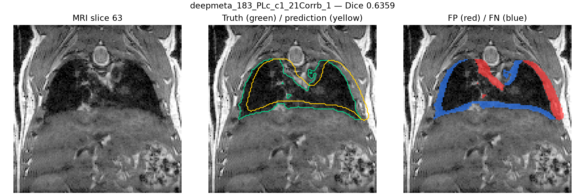
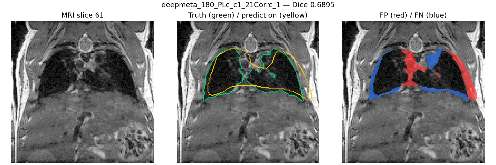
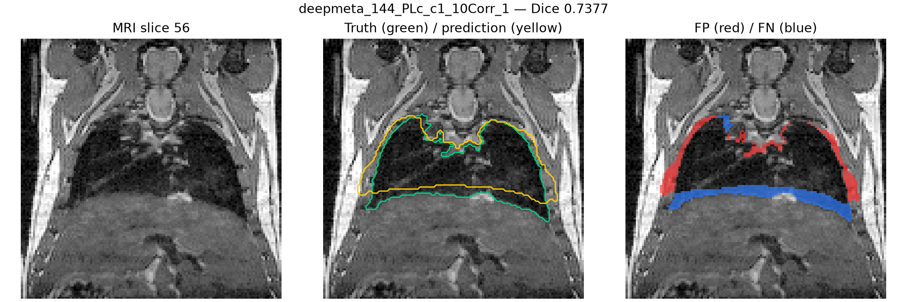

# Lung Fold 0 Validation Audit

This report records the first mouse-grouped validation result for the advanced
lung segmentation stage. Fold 0 used the `3d_safe96` configuration and the
official `nnUNetTrainer_500epochs` trainer. It contains 80 training scans and 23
held-out validation scans, with all time points from a biological mouse kept in
one fold.

## Results

| Metric | Result |
|---|---:|
| Validation cases | 23 |
| Mean Dice | 0.9176 |
| Median Dice | 0.9770 |
| Minimum Dice | 0.6359 |
| Maximum Dice | 0.9850 |
| Cases below 0.90 | 5 |
| Cases below 0.85 | 5 |
| Soft probability maps exported | 23 |

The median is substantially higher than the mean because five difficult cases
form a low-performing tail. Visual inspection shows that their errors are
concentrated around the diaphragm, mediastinal boundary, and outer lung margins.
These cases remain in the evaluation set and are not excluded from the reported
score.

## Representative difficult cases

Green contours indicate the reference lung mask, yellow contours indicate the
prediction, red areas are false positives, and blue areas are false negatives.

## Interpretation and next step

Fold 0 supports continuing the experiment, but it does not establish final
generalization. Folds 1–4 must be trained with the same configuration. Their
held-out soft probabilities will then be combined with the 23 Fold 0 maps to
create leakage-safe anatomical guidance for the lesion model.

The tracked audit CSV contains only public case identifiers and aggregate voxel
metrics. MRI data, labels, probability arrays, training logs, and checkpoints
remain outside GitHub and belong in local storage or Zenodo.