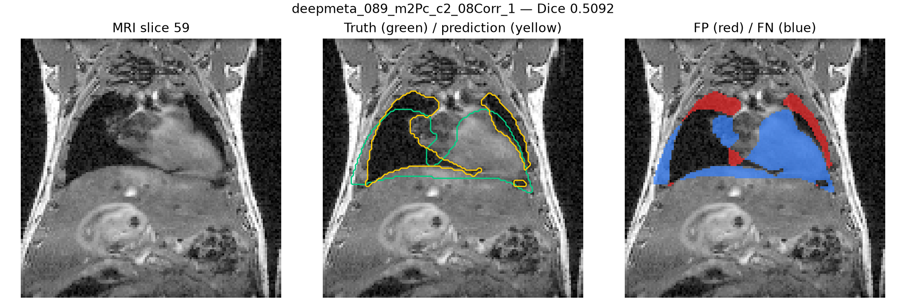
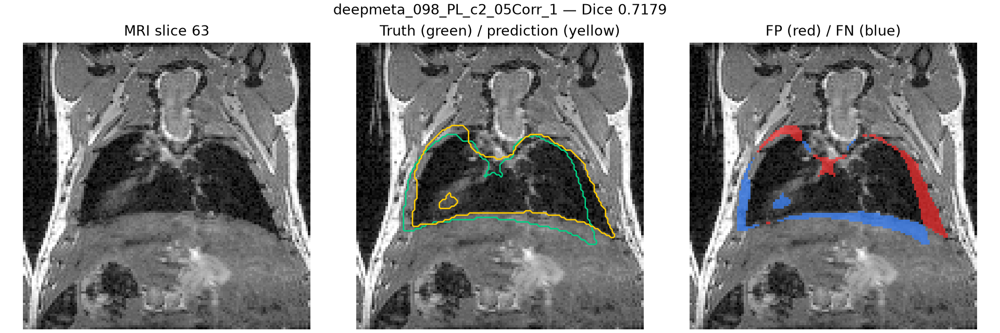
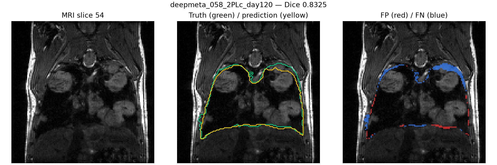

# Lung Fold 2 Validation Audit

Fold 2 completed 500 epochs using the `3d_safe96` configuration with 81
training scans and 22 mouse-grouped validation scans. All time points belonging
to a biological mouse remain in a single partition.

## Results and checkpoint selection

| Metric | Final checkpoint | Best checkpoint |
|---|---:|---:|
| Validation cases | 22 | 22 |
| Mean Dice | **0.9047** | 0.9034 |
| Median Dice | **0.9316** | 0.9297 |
| Minimum Dice | **0.5092** | 0.5069 |
| Maximum Dice | **0.9838** | 0.9812 |
| Cases below 0.90 | 3 | 3 |
| Cases below 0.85 | 3 | 3 |

The final checkpoint performed better on 19 of 22 cases. The saved best
checkpoint improved 3 cases, but only by small margins; its largest gain was
0.0024 Dice. The final checkpoint's largest case-level gain was 0.0054. The
final checkpoint was therefore selected, and all 22 soft probability maps were
exported for out-of-fold anatomical guidance.

## Difficult cases

| Case | Final Dice |
|---|---:|
| `deepmeta_089_m2Pc_c2_08Corr_1` | 0.5092 |
| `deepmeta_098_PL_c2_05Corr_1` | 0.7179 |
| `deepmeta_058_2PLc_day120` | 0.8325 |

These cases remain in all aggregate results and should receive special attention
during uncertainty and downstream lesion analyses.

## Representative overlays

Green contours indicate the reference lung mask, yellow contours indicate the
prediction, red areas are false positives, and blue areas are false negatives.

## Reproducible artifacts

The tracked `docs/assets/lung-fold2-audit/` directory contains the sanitized
summary, per-case metrics, paired checkpoint comparison, and five representative
overlays. MRI data, labels, checkpoints, training logs, NIfTI predictions, and
probability arrays remain outside GitHub and belong in local storage or Zenodo.
