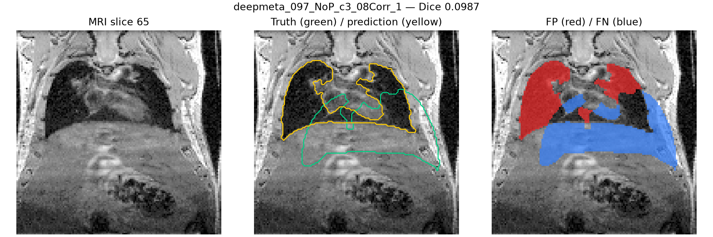
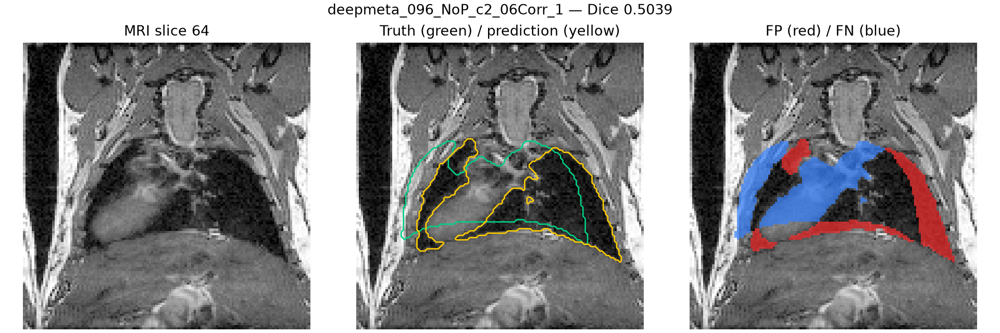
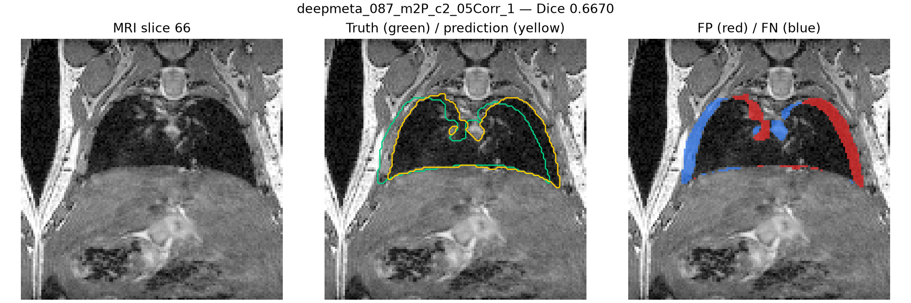

# Lung Fold 3 Validation Audit

Fold 3 completed 500 epochs using the `3d_safe96` configuration with 85
training scans and 18 mouse-grouped validation scans.

## Results and checkpoint selection

| Metric | Final checkpoint | Best checkpoint |
|---|---:|---:|
| Validation cases | 18 | 18 |
| Mean Dice | 0.8095 | **0.8411** |
| Median Dice | 0.9609 | **0.9666** |
| Minimum Dice | **0.0987** | 0.0987 |
| Maximum Dice | **0.9846** | 0.9806 |
| Cases below 0.90 | 7 | **6** |
| Cases below 0.85 | 7 | **6** |

The saved best checkpoint was selected by aggregate validation performance and
all 18 soft probability maps were exported. The paired result is not uniform:
the best checkpoint improved 6 cases while the final checkpoint was slightly
better on 12. A single case, `deepmeta_124_m2PLc_c2_12Corr_1`, improved by
0.2971 and accounts for most of the +0.0316 mean difference. The largest
selected-best reduction was only 0.0083.

## Difficult cases

| Case | Selected-best Dice |
|---|---:|
| `deepmeta_097_NoP_c3_08Corr_1` | 0.0987 |
| `deepmeta_096_NoP_c2_06Corr_1` | 0.5039 |
| `deepmeta_087_m2P_c2_05Corr_1` | 0.6670 |

The lowest case remains a severe failure under both checkpoints. It is retained
in the aggregate result and must be flagged during downstream uncertainty and
quality-control analysis.

## Representative overlays

Green contours indicate the reference lung mask, yellow contours indicate the
prediction, red areas are false positives, and blue areas are false negatives.

## Reproducible artifacts

The tracked `docs/assets/lung-fold3-audit/` directory contains the sanitized
summary, per-case metrics, paired checkpoint comparison, and five representative
overlays. MRI data, labels, checkpoints, logs, NIfTI predictions, and probability
arrays remain outside GitHub and belong in local storage or Zenodo.
