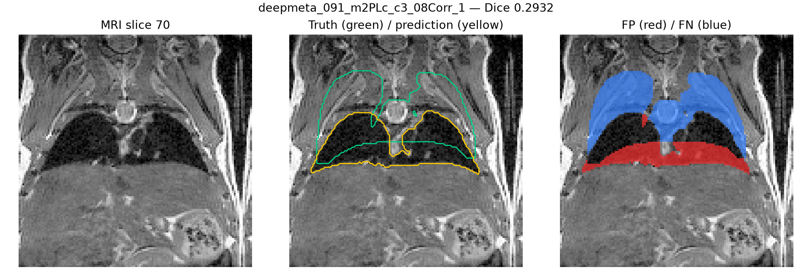
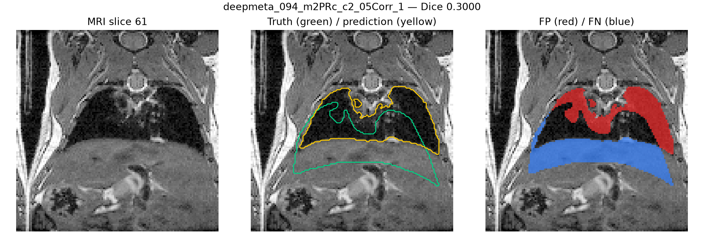
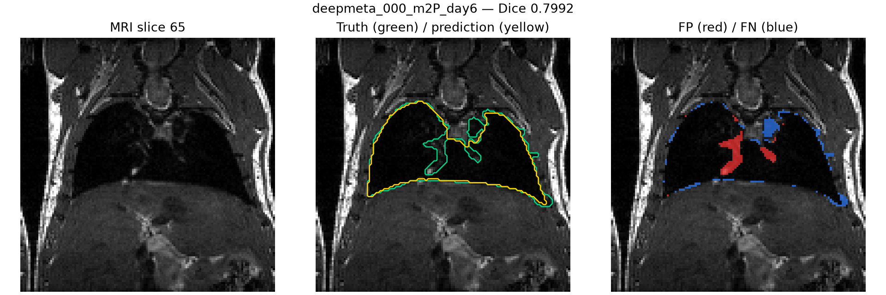

# Lung Fold 4 Validation Audit

Fold 4 completed 500 epochs using the `3d_safe96` configuration with 85
training scans and 18 mouse-grouped validation scans.

## Results and checkpoint selection

| Metric | Final checkpoint | Best checkpoint |
|---|---:|---:|
| Validation cases | 18 | 18 |
| Mean Dice | **0.8674** | 0.8669 |
| Median Dice | **0.9514** | 0.9480 |
| Minimum Dice | **0.2932** | 0.2931 |
| Maximum Dice | **0.9867** | 0.9866 |
| Cases below 0.90 | 5 | 5 |
| Cases below 0.85 | 3 | 3 |

The final checkpoint was selected because it achieved the higher mean and
median and was better on 11 of 18 paired cases. The checkpoints were very
similar: mean Dice differed by 0.0005, the largest saved-best gain was 0.0014,
and the largest final-checkpoint gain was 0.0069. All 18 final-checkpoint soft
probability maps were exported.

## Difficult cases

| Case | Final Dice |
|---|---:|
| `deepmeta_091_m2PLc_c3_08Corr_1` | 0.2932 |
| `deepmeta_094_m2PRc_c2_05Corr_1` | 0.3000 |
| `deepmeta_000_m2P_day6` | 0.7992 |

The two lowest cases remain severe failures under both checkpoints and must be
flagged during downstream uncertainty and quality-control analysis.

## Representative overlays

Green contours indicate the reference lung mask, yellow contours indicate the
prediction, red areas are false positives, and blue areas are false negatives.

## Lung-stage completion

Fold 4 supplied the final 18 maps. The combined five-fold export contains 103
files for 103 unique source cases, with zero missing, duplicate, or unexpected
case identifiers.

The tracked `docs/assets/lung-fold4-audit/` directory contains sanitized metrics,
the checkpoint comparison, and five overlays. Raw MRI, labels, checkpoints,
logs, predictions, and probability arrays remain outside GitHub.
